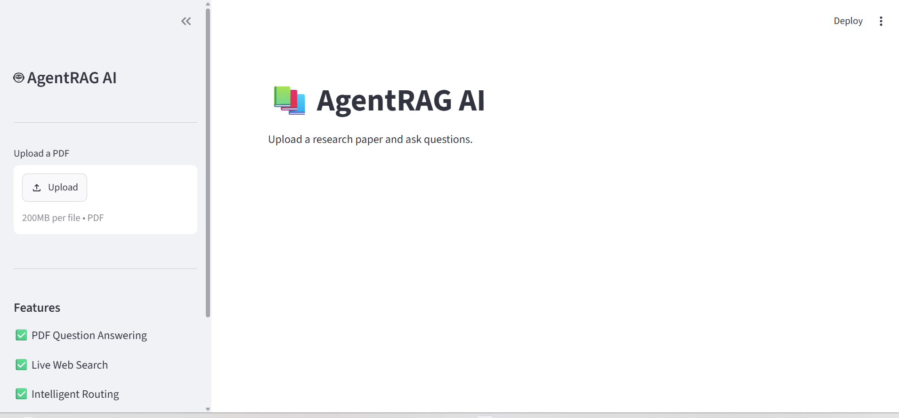
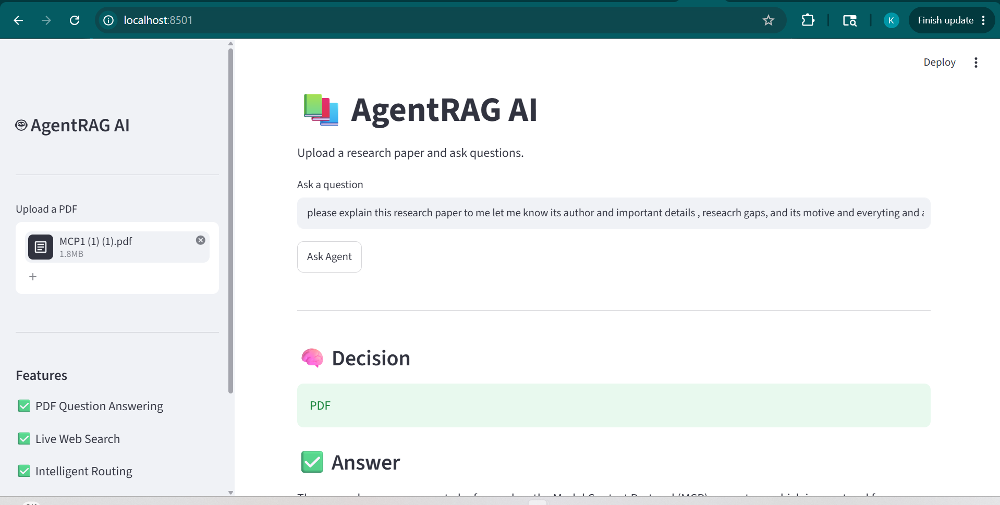

# 🤖 AgentRAG AI

An Agentic Retrieval-Augmented Generation (RAG) application that allows users to upload research papers in PDF format and ask natural language questions. The system retrieves relevant document chunks using semantic search and generates context-aware responses using Groq LLM.

---

## 📌 Features

- 📄 Upload research papers (PDF)
- 🔍 Semantic document retrieval using FAISS
- 🧠 HuggingFace Sentence Transformer embeddings
- 🤖 Context-aware answers using Groq LLM
- 🔄 Agentic workflow using LangGraph
- 💬 Interactive Streamlit interface
- ⚡ Fast and efficient Retrieval-Augmented Generation (RAG)

---

## 🏗️ Project Architecture

```
PDF Upload
      │
      ▼
Text Extraction
      │
      ▼
Text Chunking
      │
      ▼
HuggingFace Embeddings
      │
      ▼
FAISS Vector Store
      │
      ▼
Retriever
      │
      ▼
LangGraph Agent
      │
      ▼
Groq LLM
      │
      ▼
Generated Response
```

---

## 🖥️ User Interface

### Home Screen



### Question Answering



---

## 🛠️ Tech Stack

- Python
- Streamlit
- LangChain
- LangGraph
- FAISS
- HuggingFace Embeddings
- Groq API
- PyPDF
- Sentence Transformers

---

## 📂 Project Structure

```
AgentRAG-AI
│
├── app.py
├── backend.py
├── requirements.txt
├── README.md
├── .gitignore
├── .env.example
├── assets/
├── sample_documents/
└── AgentRAG_AI.ipynb
```

---

## ⚙️ Installation

Clone the repository

```bash
git clone https://github.com/YOUR_USERNAME/AgentRAG-AI.git
```

Move inside the folder

```bash
cd AgentRAG-AI
```

Install dependencies

```bash
pip install -r requirements.txt
```

Create a `.env` file

```text
GROQ_API_KEY=your_key_here
TAVILY_API_KEY=your_key_here
```

Run the application

```bash
python -m streamlit run app.py
```

---

## 🎯 Future Improvements

- Chat history
- Multiple PDF support
- Persistent vector database
- PDF citation highlighting
- Cloud deployment
- Authentication

---

## 👩‍💻 Author

Khadeeja Haider
